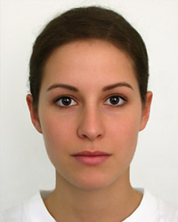
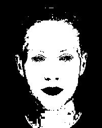

# Skin detection application based on Bayesian classifier

Use Bayesian classifier with a training image to calculate the probability of whether a pixel is a skin pixel.


| Original image | Ground Truth Mask | Detection Result |
| - | - | - |
|  |  |  |


## Get started

> First time

```bash
make all
```

> After first time

```bash
make start
```


## Dependency

- Python 3+
- numpy
- PIL
